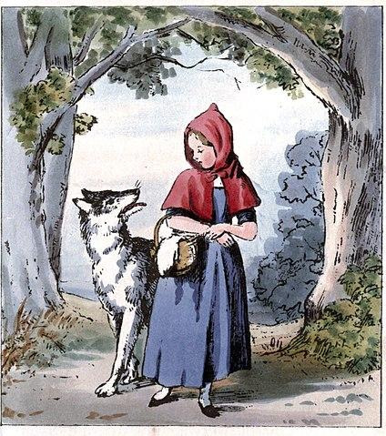

# El Lobo Feroz

Feroz, el lobo, se siente desnutrido y famélico y quiere un sistema para simular sus actividades diarias. Quiere mejorar su estado de salud, comiendo saludable y a la vez haciendo ejercicio para no excederse en su peso. 

## Requerimientos básicos:

1. Averiguar si feroz está saludable, lo que se deduce de que su peso esté entre 20 y 150 unidades. Se sabe que inicialmente pesa 10 unidades, por lo que no está saludable.

2. Que el lobo aumente (o disminuya) su peso en una cantidad de unidades indicada.

3. Que al lobo sufra una crisis que lo hace volver a su peso inicial. 

## Caperucita Roja:

	El lobo va corriendo hasta el bosque. Allí se encuentra con Caperucita, conversan, pero no pasa nada más.
	>>> lobo.irCorriendo()
	
	Luego, el lobo corre a la casa de la abuelita y luego de comersela, se disfraza de ella.
	>>> lobo.irCorriendo() 
	>>> lobo.comer(abuelita)
	
	Mientras tanto, Caperucita cruza el bosque y se le cae una manzana de su canasta.
	>>> canasta.perderManzanas(1)
	
	Cuando feroz ve llega a Caperucita a la casa, molesto por las preguntas incisivas sobre su aspecto físico, abre grande su boca y se come a Caperucita con canasta llena y todo.
	>>> lobo.comer(caperucita)
	>>> lobo.comer(canasta)
	
	Finalmente, llega el cazador…
	¿El lobo también se lo come de un bocado?
	>>> lobo.comer(cazador)
	>>> lobo.estaSaludable()
	true
	
	¿El cazador provoca una crisis en el lobo?
	>>> cazador.intimidarConEscopetaA(lobo)
	>>> lobo.estaSaludable()
	false
	
	¿Qué otra cosa puede suceder?
	El cazador convence al lobo del mal de sus acciones y, llevando a cabo una operación quirúrgica con gran habilidad (el cazador tiene titulo de cirujano), rescata a caperucita y su abuelita del estomago del lobo.
	>>> cazador.rescatar(caperucita)
	>>> cazador.rescatar(abuelita)
	>>> lobo.estaSaludable()
	false

## Los chanchitos:

	El lobo sopla primero la casa de paja, donde hay un chanchito, la hace caer y el chanchito huye a la casa de madera donde estaba el otro chanchito.
	>>> lobo.soplarCasa(casaPaja)
	>>> casaMadera.agregarOcupantes(1)
	
	El lobo corre hasta la casa de madera, la sopla y también la tumba, por lo que ambos chanchitos huyen.
	>>> lobo.irCorriendo()
	>>> lobo.soplarCasa(casaMadera)
	>>> casaLadrillos.agregarOcupantes(2)
	
	¿Se come a alguno de los chanchitos?
	El lobo, ya completamente desnutrido, sopla la casa de ladrillos con su energía restante y se come a los tres chachitos. El lobo se da cuenta que comer a los chanchitos no valió el esfuerzo, y habiendo caído a su punto más bajo, entra en una profunda depresión. BAD END
	>>> lobo.soplarCasa(casaLadrillos)
	>>> lobo.comer(chanchito)
	>>> lobo.comer(chanchito)
	>>> lobo.comer(chanchito)
	>>> lobo.estaSaludable()
	false
	
	Alternativamente, el chanchito de la casa de ladrillos sabía Kung Fu, así que revienta a trompadas al lobo antes de que pueda lastimar a su familia. El lobo sufre una crisis debido a su derrota. El lobo decide ir al nutricionista que le recomendo el cazador y dejar de comer inocentes. GOOD END
	>>> lobo.soplarCasa(casaLadrillos)
	>>> chanchito.aLasTrompadas()
	>>> lobo.irAlNutricionistaYComerSaludable()
	>>> lobo.estaSaludable()
	true

